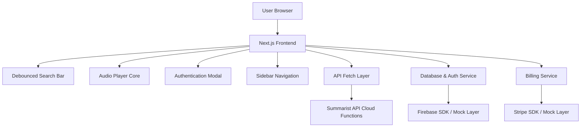

# Implementation Plan - Summarist v2

This document details the plan to create **Summarist v2**, a modern book summary platform featuring user authentication, content retrieval from Cloud API endpoints, an interactive audio player, subscription billing with Stripe, and personalized dashboards.

---

## User Review Required

> [!IMPORTANT]
> The original project uses Vanilla CSS. However, modern Next.js templates defaults to Tailwind CSS. We recommend **Tailwind CSS** for responsive design, component layout, and maintainability. Please let us know if you prefer to stick to Vanilla CSS.

> [!WARNING]
> Setting up live Firebase Authentication, Firestore, and Stripe Checkout requires developer credentials. We propose implementing a **toggleable Mock Layer** (enabled by default) so you can test all features instantly, with clear placeholders and configuration files for when you are ready to drop in your live API keys.

---

## Open Questions

1. **Styling Framework**: Would you like us to use **Tailwind CSS** (highly recommended for speed, responsiveness, and neat code structure) or stick to the **Vanilla CSS** provided in the original repository?
2. **Firebase and Stripe Credentials**: Do you want us to set up live integrations immediately (you will need to provide config values or set environment variables), or start with a robust **Mock System** so you can run the app locally without API keys first?
3. **Redux vs. React Context**: For global state (e.g., Auth state, Audio Player state, Library state), do you prefer **Redux Toolkit** (as in the course) or **React Context API** (lighter, native)?
4. **Routing directory**: Next.js App Router (recommended) or Pages Router?

---

## Proposed Architecture

### Pages and Routes
- `/` - Landing Page
- `/for-you` - Dashboard (Selected Book, Recommended, Suggested)
- `/book/[id]` - Inside Book Details Page (Description, Author details, Free/Premium check)
- `/player/[id]` - Audio Player Page (interactive progress slider, speed, skip buttons)
- `/choose-plan` - Plan Selection Page (monthly, yearly with trial)
- `/settings` - Subscription settings and account details
- `/library` - Saved and finished books listing

---

## Proposed Changes

We will create a clean Next.js 14+ project in TypeScript using npm.

### Core Stack
- **Framework**: Next.js (App Router, TypeScript)
- **State Management**: Redux Toolkit (or Context API based on feedback)
- **Icons**: `react-icons`
- **Audio Control**: HTML5 Audio Web API with custom React hooks

---

## Verification Plan

### Automated Verification
- Run `npm run lint` and `npm run build` to verify code compilation and TypeScript type safety.
- Run dev server locally on port 3000 to interact with the features.

### Manual Verification
1. **Landing & Modal**: Verify login/registration and guest sign-in.
2. **Dashboard**: Check that books load on `/for-you` and render correct pills (Free vs Premium).
3. **Search & Debounce**: Verify typing triggers search only after 300ms pause.
4. **Playback**: Verify audio play, pause, seek, and end (marks book as finished in library).
5. **Billing Mock**: Upgrade account on `/choose-plan` and verify settings page updates subscription status.
